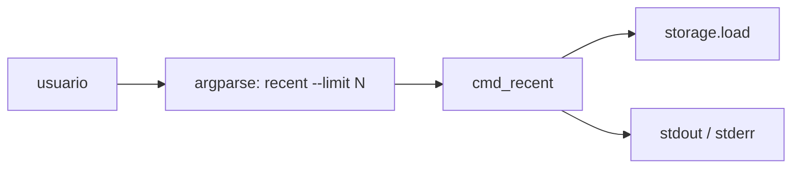

# Design — cli_recent

## Overview

Nuevo subcomando `recent` en el CLI que reutiliza `storage.load()`, ordena en
memoria por `created_at` descendente y aplica un slice `[:limit]`. No toca la
capa de almacenamiento ni el modelo de dominio.

## Arquitectura

Encaja íntegramente en la capa de interfaz (`src/cli.py`), siguiendo el mismo
patrón que `list`:

## Componentes e interfaces

| Archivo        | Cambio                                                                 |
|----------------|------------------------------------------------------------------------|
| `src/cli.py`   | Nueva función `cmd_recent(args) -> int`                                |
| `src/cli.py`   | Subparser `recent` en `build_parser()` con `--limit` (`type=int`, `default=5`) |
| `tests/test_cli.py` | Nueva clase `TestRecent`                                          |

## Modelos de datos

Sin cambios. Se usa el campo existente `created_at` (ISO 8601, ordenable como
string).

## Manejo de errores

- `--limit <= 0` → se lanza `NoteError("--limit debe ser > 0")` antes de cargar
  nada; el `main()` existente lo captura, escribe en stderr y devuelve 1.
  Así se cumple 2.3 (no se abre el archivo).

## Estrategia de testing

| Test                                              | Criterios   |
|---------------------------------------------------|-------------|
| `test_recent_default_limit_orders_desc`           | 1.1, 1.3    |
| `test_recent_custom_limit_format`                 | 1.2, 1.4    |
| `test_recent_empty_outputs_nothing`               | 2.1         |
| `test_recent_invalid_limit_zero`                  | 2.2, 2.3    |
| `test_recent_invalid_limit_negative`              | 2.2, 2.3    |

Todos ejecutan el CLI real vía `subprocess` contra un directorio temporal.

## Alternativas descartadas

- **Añadir `--sort` y `--limit` a `list`** en vez de un comando nuevo:
  descartado porque cambia el contrato de `list`, que ya usan scripts, y
  mezcla dos intenciones en un comando.
